# Pseudocode Interpreter
These are tic-tac-toe games I'd made over the years, one a generic tic-tac-toe game designed to play with two players, my first "PROJECT" i'd ever made in python. The other is a tic-tac-toe game that can be played against a computer, with moderate difficulty. Both are terminal based games; first one uses typed inputs, the second one uses keyboard keys (arrows, enter, etc.).

FIRST PROJECT (TicTacToe.py)
*Date created:* March 2021 | 
*Date last updated/modified:* -

SECOND PROJECT (TicTacToeWithBot.py)
*Date created:* March 2021 | 
*Date last updated/modified:* -

## How to run the program

###Prequisites
FIRST PROGRAM, TicTacToe.py does not have any external libraries
SECOND PROGRAM, TicTacToeWithBot.py uses one external library which are not typically present in a regular python installation. 

(note: the emoji displaying on terminal may be broken if you do not set JetBrainsMonoNL-Regular.ttf installed. There seems to be a bug currently in the regular terminal with Cascadia Mono, the default font. It will run fine on VSCode however. The Fix is detailed below.)

The bug
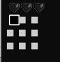

###How To Fix The Emoji display bug on terminal
1. Install JetBrainsMonoNL-Regular.ttf. The font file is included in this repository, as well as [this link](https://www.jetbrains.com/lp/mono/#how-to-install). 

If you're downloading the font fami from the link, navigate to Fonts > ttf in this folder, once unzipped and install JetBrainsMonoNL-Regular.ttf.

2. Click on the arrow on this screen once you open the program.  This will open the menu on which you can click settings.
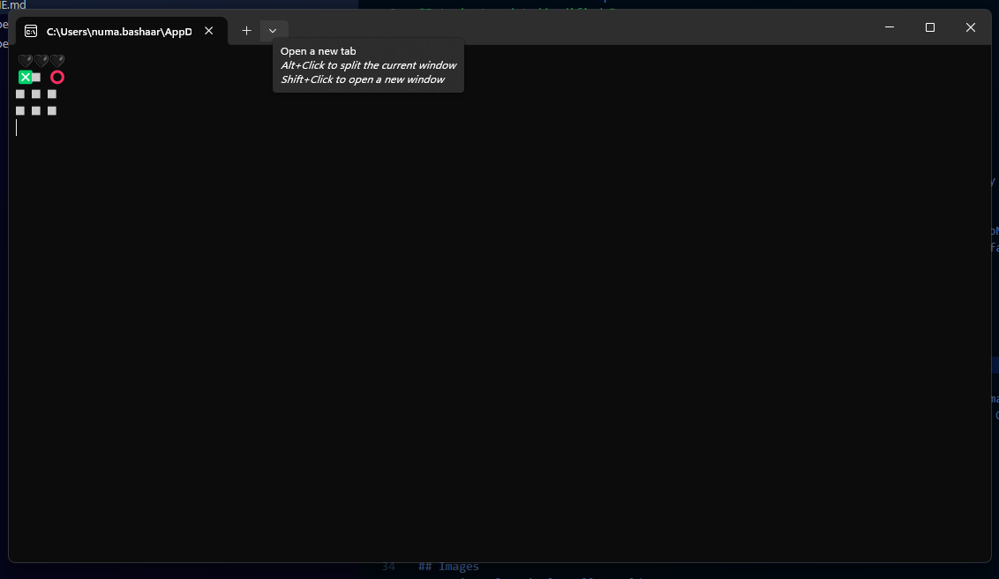 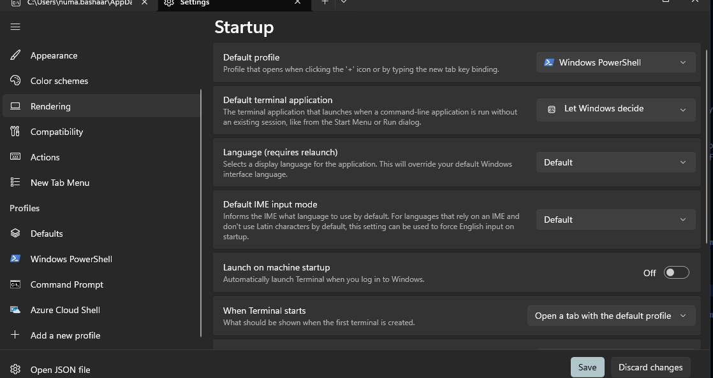

3. Check profiles > Default and open it.

(note, the aforementioned images will have it show how to change font in Windows Powershell profile, but for most computers, changing default appearance should be enough)

4. Scroll to the very bottom of the menu for additional settings. In here, click appearance.
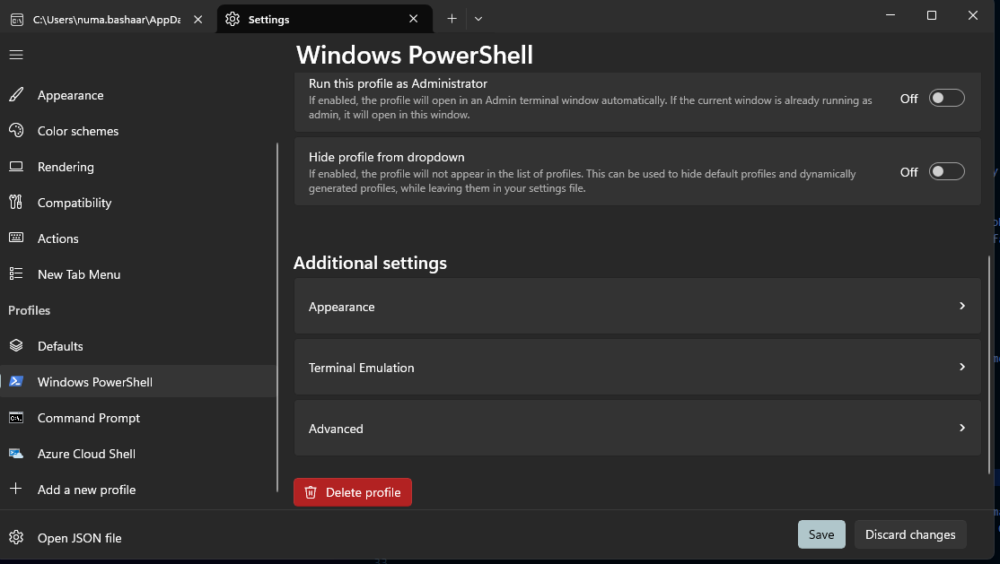 

5. Select the textbox next to the Font Face to change font. If the font does not show up, click the checkbox to show all fonts, and select JetBrains font.
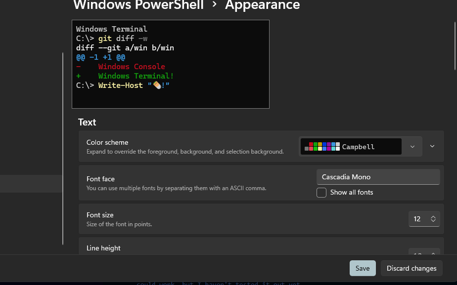 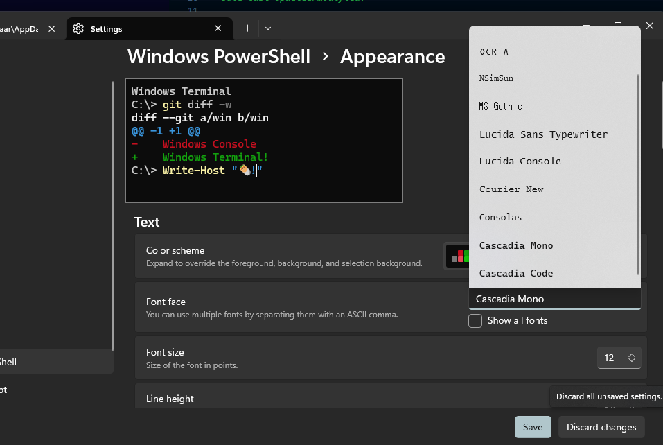 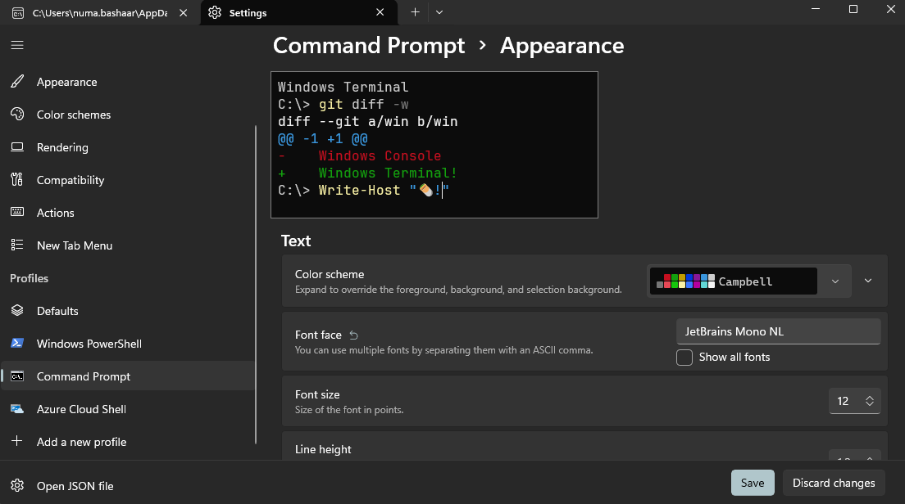

6. Click save.

7. Repeat the same steps for terminal, and powershell to ensure both terminals run the program correctly.

7. If the font does not change, and it still looks like the bug image;
- ensure Jetbrains is installed
- open your program again after closing terminal
- ensure you have changed appearance of font in default profile, and terminal and powershell
- restart your machine

---
1. *Install Python if it is not present in your computer.* The version I have on my machine is python 3.11 available to download [here](https://www.python.org/downloads/release/python-3110/). Other versions of python could work, but I haven't tested it out yet.

2. Ensure you have keyboard library installed on the computer if you're running TicTacToeWithBot.py. If it is not missing, just run this command.

```
pip install keyboard
```

3. *Install the file which you want to run.*

4. *Open the file and enjoy!.*

## Images
FIRST PROGRAM
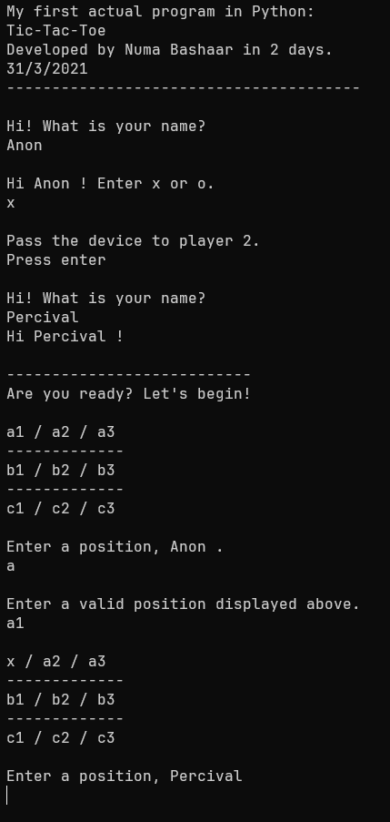

SECOND PROGRAM
Default game
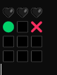

Playing game // green symbols mean that's where the cursor is, if there's no symbols on selected box, it will show an outlined box
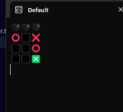  

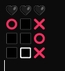

It picks random colors for the hearts - right hand side indicates color of computer, left hand side is the color of the user. The method by which the scoring is done is explained under How The Program Works

Draw state
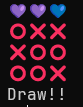

Win state (computer)
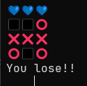

Win state (user)
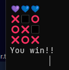

How the program looks on VSCode
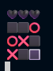
Terminal in VSCode seems to vary a lot depending on your computer. In some computers, it may look like this, while in my computer it looks better.

As such, the recommended way to run this program - if you want a more visually pleasing display, is to go for running it on the default terminal with JetBrainsMono font.

## OVERVIEW OF BUILD
### Why I Made This
Tic-tac-toe was probably one of the first python programs I'd made. Sure, I'd made other 'programs', my first being a manual WOMBAT test program - where the user had to enter answers and it'd calculate the score. But these were just random programs.

One day, in the school, our teacher gave us a task of creating a tic tac toe program in Pseudocode (I'd already explained what pseudocode is on my latest program, which you can check out [here](https://github.com/PixiePowers351/igcod-compiler)), and I'd finished it in class. After writing it there, I decided to come back home and write my code in python.

Of course, I didn't know about arrays when I first started making it, but I used manual variables for every single coordinate. I spent maybe... 2 or 3 days on the program - partially because of school, the only time I could really code was during night, and I like programs to be visually pleasing. They can be easy, but they still need to look good.

That's one of the main reasons I'd made - and still make terminal-based games. I like constraints in design when I make something, be it using Canva for graphic design, or terminal for display. If it was a GUI, sure, I guess I could make it look better and be more consistent, and design better looking symbols, but there's a certain appeal to make something look good when you have very little symbols and emojis to represent, the thing you want to represent. And then, you will run into issues with visuals, etc.

And on top of it, I'm not.. particularly interested in drawing. I could draw decent assets, sure, but the appeal in making these programs is not inherently making the most visually pleasing design, but to see if I can even make the logic, and can I make a good design with a very limited set of emojis to show what I'm trying to show? Is there a unicode symbol for a green x, what's the best and fun way to show progress without it looking out of place? What should be the refresh rate of the screen? 

It's more interesting to make programs that run on terminal, simply because you have to handle the rendering as well as design, and I know if I had to design assets, I'd probably spend far too long on them, and lose interest in the project. However, I am going to build a project soon with graphics - I've been working on it.

So for the second program, which I made on 2023 just before my O Levels, I'd seen a lot of people making 'AI's to play with humans. An AI to beat a person at four-in-a-row, etc, and I thought, maybe I could take a shot at the code too. The method by which I which the second program is explained below, since the first program is a more of a pre-build? It's a pretty simple program, and I don't think the code warrants much of an explanation. The main project in question is ticTacToeWithBot.py, a program that lets you play tic-tac-toe against a semi-good computer.

### How the program works
This program, like most of the other terminal based games i've made, like [Minesweeper](https://github.com/PixiePowers351/minesweeper), [Tetris],(https://github.com/PixiePowers351/tetris), etc. has a similar ish structure. It has a map with symbols (in this case, for the hearts on token), a display function, and a while loop that checks for keyboard inputs and checks for the code associated upon the keypress, and runs it.

#### The Scoring system
The score is tallied - every time the user wins, one point, and vice versa for the computer.

The colors are filled in based on relative percentages of how much the user has won - if they've won more than 90% of the time, all the hearts are filled with user color.
- If they've only won between 50% - 90%, they get 2/3 hearts.
- If they've won more than 1/3 rd of the time (percentage wise), they get a score of 1 heart.
- If their score is less than 33.3%, they get a score of 0, aka, the computer has all the hearts.
- If there was no game yet, all players have a score of 0, hence, the bar is filled with black hearts.

This score is displayed on the top as hearts, since I felt that including text with emojis would be quite distracting.

The color of the user and the computer changes every time it is launched, just because it's fun and adds some replayability

#### The 'AI'
Granted, it's not an AI program. It's more similar to a really good algorithm to determine moves, but in this case, I decided to make it simple. Not so easy in the meaning that it only generates random code, but not so hard that it's impossible to win - kind of like how a human might play if they knew the rules of the game, but didn't know every trick of winning.

The basic way it works is to check if there's any winning moves for them, and then plays that move. If the user is about to win, it blocks one of the moves. If there's no obvious place to play, it will pick randomly.

It's not difficult to win against - but it does very much depend on luck.


Say, this state. Because the user used the triangle strategy - place three symbols at the edges of the map, the computer can only potentially block one of these moves, and so they win.

The only reason it doesn't always end in a draw is because it doesn't have a strategy. But that was by design. Of course I could've made that, but I wanted the game to be FUN. You'd know that if you play tic-tac-toe against a person who knows the ways to win, it'll always end up in a draw. Which.. is hardly fun. As such, I've made it have no strategy intentionally. So you get that sweet taste of dopamine if the computer just randomly fumbled and you get to win, but it doesn't feel like, it's bad. Because that's not interesting either. If you were to win every single game against someone, you'd be bored too.

So my bot just plays how a human who knows how the rules of tic-tac-toe would play, but doesn't know any strategies to always win.

#### Input/Output
Well, I'm not the greatest fan of typing in commands. I feel like its a bit... complicated for most people, and I want my game to be fun, not complicated or niche. So I've implemented keyboard support. Press arrow keys to change the cursor, space to input your symbol, and the computer does its move and replay. It's the same display strategy as all of my other games - have each array on the board contain a set of values, and then print out the key it is supposed to represent.

This program uses emojis, similar to [Tetris],(https://github.com/PixiePowers351/tetris). I usually use emojis rather than unicode symbols unless there's a good reason for it - like, no symbols to display what I want, like I did in [chess](https://github.com/PixiePowers351/chess-terminal), or that it doesn't look nice. Emojis are also more familiar to people, so it just looks better for most simple terminal games like this - the only downside being rendering - sometimes it may look bad, depending on the system, and it's on set of emojis, and how they handle them. Using color codes leads to more ... well... consistent behavior, but in this case, i dunno.. emojis look better so I went with them.

### Optimisations

I wanted to leave my program as it originally was. Like an archive, but I do admit, some optimisations are in order. While it will run fine on an average PC, for higher end PC's, there's noticable flickering / lag. I'd made this on just my machine, but I admit, this is a problem for most higher-end PC's i've tried running this on.

So I might roll out a fix with better optimisations, using tuples with symbols rather than checking values manually during display, and .. I have seen some people roll out libraries to update the screen with less flickering, so I might include it on a later build if it looks fine.

On top of that, the algorithm isnt.. the best? It still checks every single. Row manually, aka, line by line, using a for loop and checking the count of user moves, using a counter c for every single state, every single type of move - row, column, and diagonsls and seeing if it's a specific counter, rather than list comprehensions with a lenght function, or using basic list count operations with list splitting. It does this for every single part of code, to check if the user won, to check if the computer can win, if the user has a winning move.

But I uploaded this revision because it's interesting to see how far I've come. It's interesting to see how a program which I considered to be the best of the best - I made a whole bot that could play a game, and it feels fun! To being able to see how my coding style has changed, and how I've learnt a lot more features.

And I'm sure to continue that later too.

### New concepts I learnt while making the program

FIRST PROGRAM
The first program was when I was just starting to learn how to code with familiar syntax. As such, I learnt the basic programming syntax, input, output, if statements, loops. 

I guess I did know coding - ish a bit earler than march though? My first experience; beyond like, random coding sites I visited in grade 4-7 like in Khan academy, was in making spreadsheets programs such as [this](https://docs.google.com/spreadsheets/d/1HOQGT2mHTRkIIy_OurlO9hNAwUplRdFVtQLyXg8Zfvc/edit?usp=sharing) at the beginning of 2021, right when I started O Level Computer Science.

As such, I heavily resisted in learning to code in a program at the very beginning. I usually don't like learning programs meaninglessly unless there's a clear reason to - it's the main reason why most of my code is in python rather than C or some other coding program. I CAN write in C, but I'm not as familiar with the syntax and everything, and i'd have to spend more tim figuring out how pointers worked, or how string handling works. There are use cases for it, sure, some cool stuff I could do from C that I can't do in python, most noticably faster programs and the ability to generate an .exe that anyone can run.

But I haven't had a strict limitation per se to take a new language. So until i reach the limits of python, I will keep making my projects in python. 

Anyway, back to it. I'd learnt spreadsheet coding, but I was forced to take up python because there's multiple limitations. 

1. *No easy variables / data structures to work with:* You really have to remember what each cell does - I am sure there are ways to name cells, but that doesn't fix the issue of it not having arrays (which again, now I know about, but I didnt know how to use it then.)

2. *No formal loop structure:* There ARE loops, but again - it's not.. very easy - and I've yet to get it to work - without breaking. As such, you can't recursively check every item in a list, do one operation, and then combine, and... it's not easy.

3. *No way to have a cell that can change values and also let the user enter anything without breaking stuff:* Like, say, I'm trying to make a program that will.. let the user play tic-tac-toe. There's no way for me to make one easily, because every cell needs to have a formula, and if the user input something in the cell, they win, they'd have to put back all the formulas again... essentially it's hard. Yes, I know about google apps script, but I'm still not familiar with said feature yet.

## Future implementations / known bugs im working on fixing

Again, it's not like it's broken, or I have really good features, but if I was going to work on this program and fix it up, which.. I probably won't, but let's say I hypothetically did, I would probably include these.

### BUGS:
- *Terminal freezing:* Mostly an optimisation issue, but should be an easy fix. I eplained how i'd go about it a bit earlier.

### Future implementations:
It's Tic-tac-toe. I don't think there's any thing I could reasonably implement, maybe a help menu for indicating actions of each keypress, a tutorial, etc? Difficulty options? If I was reworking on it - potentially on C or something next time as a practice for C - i think it'd be funny if this was my go-to first program for all programming languages, I might include them in that build, but that's potentially March-April, not yet.

Regardless of that, here's what I'm actually working on fixing:
COMMENTING.

I don't usually comment much, because even after not seeing a program for four years, I can usually come back, and assuming there's very vague comments, and normal variable names, I can usually figure out what is being done there. But I do understand that with code that a lot of people will view, comments are important, and as such I will obviously include commenting - i can remmeber how I usually ended up with the logic and should be able to decently explain it. Right after I finish making READMEs of all projects, of course.

---

If you have any bugs, suggestions or any questions regarding this program, send an email to me on pixiepowers351@gmail.com with a copy of the files in the compiler folder, specifically the code.txt file and the settings.json file, and i'll be sure to respond in a few days at least, and try to fix it in a week or so. 


Or you could alternatively post the issue on github with your error, and anything else, and I'll respond! This program doesn't really rely on external files, so I could work on it far easier if it's posted on github.
